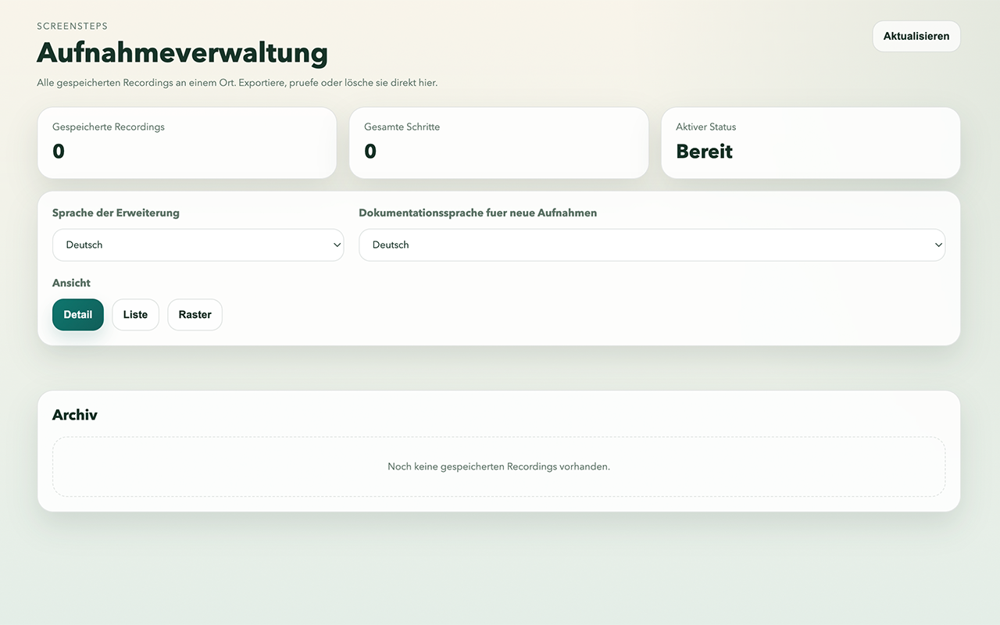
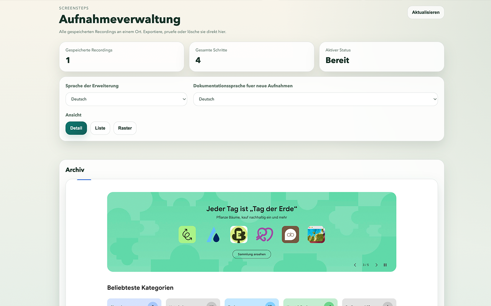
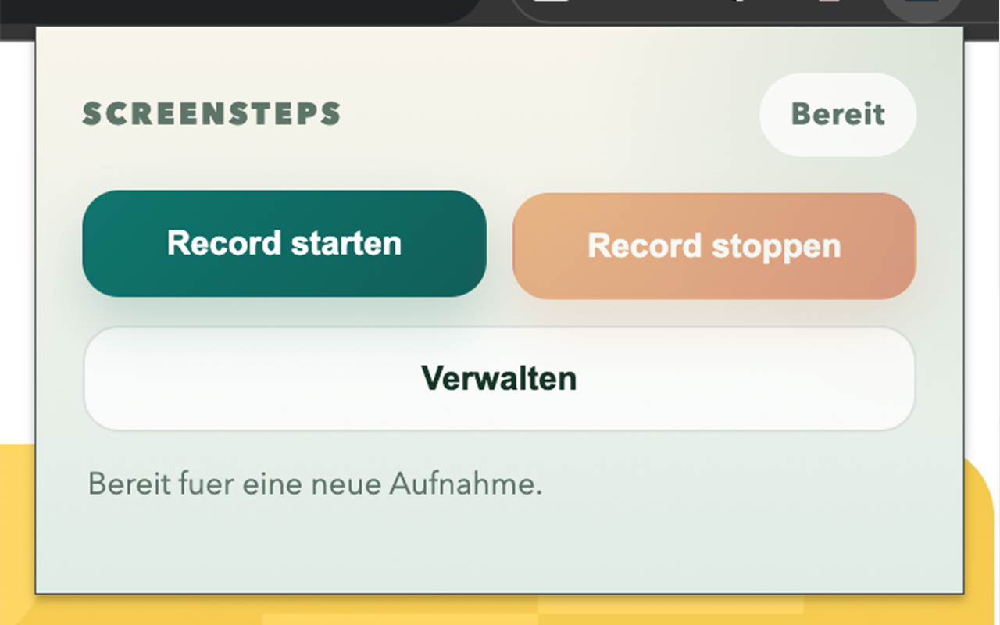
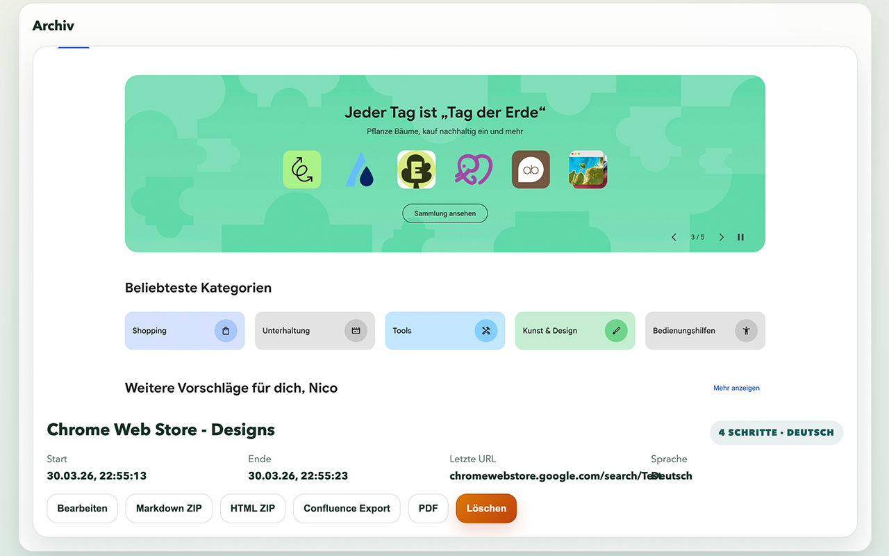
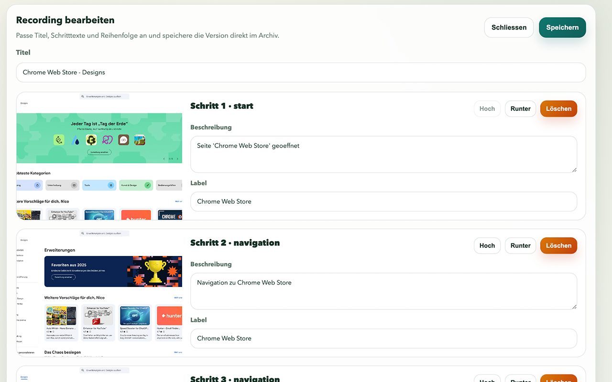

<div align="center">
  
  <h1>ScreenSteps</h1>
  <p><strong>Dokumentiere Browser-Workflows. Screenshot für Screenshot.</strong></p>

  <p>
    
    
    
    
  </p>

  <p>
    <a href="https://ni920.github.io/ScreenSteps/">Website</a> ·
    <a href="https://ni920.github.io/ScreenSteps/privacy.html">Datenschutz</a> ·
    <a href="https://chromewebstore.google.com">Chrome Web Store</a>
  </p>
</div>

---

## Was ist ScreenSteps?

ScreenSteps ist eine **lokale Chrome-Erweiterung** (Manifest V3), die relevante Nutzerinteraktionen auf Webseiten aufzeichnet, nach jedem Schritt automatisch einen Screenshot des sichtbaren Tabs erstellt, das betroffene UI-Element im Bild markiert und das Ergebnis als saubere Schritt-für-Schritt-Dokumentation exportiert.

> **Kein KI-Modell. Kein Server. Keine Datensammlung.**  
> Alle Daten bleiben ausschließlich lokal in `chrome.storage.local` auf deinem Gerät.

---

## Screenshots

<table>
  <tr>
    <td></td>
    <td></td>
  </tr>
  <tr>
    <td align="center"><em>Popup – Bereit zum Aufnehmen</em></td>
    <td align="center"><em>Aufnahme aktiv</em></td>
  </tr>
  <tr>
    <td></td>
    <td></td>
  </tr>
  <tr>
    <td align="center"><em>Verwaltung – Alle Recordings</em></td>
    <td align="center"><em>Schritte bearbeiten</em></td>
  </tr>
</table>


<p align="center"><em>Export-Ansicht – Markdown, HTML, Confluence oder PDF</em></p>

---

## Features

| | Feature |
|---|---|
| 📸 | **Automatische Screenshots** nach Klick, Eingabe oder Navigation – auch bei Same-Tab-Routenwechseln moderner Web-Apps und robusteren Zielseiten-Captures |
| 🎯 | **Visuelle Markierung** des interagierten Elements direkt im Screenshot |
| ✏️ | **Schritte bearbeiten** – Titel, Texte, Reihenfolge und Aktivierung im integrierten Manager |
| 🧭 | **Ruhigere Verwaltung** – Export-Menü schwebt als Popover, lange URLs bleiben kompakt, und nach dem Speichern geht es zurück ins Archiv |
| 📋 | **Schnell teilen** – Abläufe direkt mit eingebetteten Bildern in die Zwischenablage kopieren, z. B. für Teams |
| 🔁 | **Abläufe sichern & importieren** – gespeicherte Flows als `.screensteps` Datei mitnehmen und später wieder ins Archiv laden |
| 📦 | **Vier Dokumentations-Exporte**: Markdown ZIP · HTML ZIP · Confluence Export · PDF |
| 🌍 | **Deutsch & Englisch** – UI-Sprache und Dokumentationssprache unabhängig einstellbar |
| 🔒 | **100 % lokal** – kein Backend, kein Tracking, kein Account |
| 🚫 | **Kein KI-Modell** – Beschreibungen basieren auf echten UI-Labels, nicht auf Sprachmodellen |
| 🌐 | **Offline nutzbar** – kein Server, keine Cloud-Infrastruktur, keine externe Abhängigkeit |

---

## Installation

### Aus dem Chrome Web Store *(empfohlen)*

1. [Chrome Web Store – ScreenSteps](https://chromewebstore.google.com) öffnen
2. **„Zu Chrome hinzufügen"** klicken – fertig

### Manuell (Entwicklermodus)

```bash
# Repo klonen
git clone https://github.com/ni920/ScreenSteps.git
```

1. `chrome://extensions` in Chrome öffnen
2. **Entwicklermodus** (oben rechts) aktivieren
3. **„Entpackte Erweiterung laden"** klicken
4. Den Ordner `ScreenSteps/` auswählen

---

## Schnellstart

```
1. Eine normale http / https-Webseite öffnen
2. Optional: Verwaltung öffnen → Sprache einstellen
3. Erweiterung anklicken → „Record starten"
4. Auf der Webseite interagieren (Klicks, Formulare, Navigation)
5. Erweiterung öffnen → „Record stoppen"
6. In „Verwalten" → Schritte prüfen → über „Exportieren" ausgeben
7. Optional: Eine `.screensteps` Datei in der Verwaltung wieder importieren
```

---

## Exportformate

| Format | Beschreibung |
|---|---|
| **Markdown ZIP** | `README.md` + `images/`-Ordner – ideal für GitHub, Notion, Confluence via Copy-Paste |
| **HTML ZIP** | `index.html` + `images/`-Ordner – standalone, im Browser öffenbar |
| **Confluence Export** | Einzelne HTML-Datei mit eingebetteten Bildern – direkt in Confluence einfügbar |
| **PDF** | Browser-Druckdialog → *Als PDF speichern* |

### Archivtransfer

Gespeicherte Abläufe lassen sich zusätzlich als `.screensteps` Datei sichern und über **„Ablauf importieren"** wieder in das lokale Archiv einer anderen oder derselben ScreenSteps-Installation übernehmen.

### Schnell teilen

Über **„Exportieren" → „Zwischenablage"** kopiert ScreenSteps einen HTML-Report mit eingebetteten Base64-Bildern direkt in die Zwischenablage. Danach kann der Ablauf direkt in Teams, Chats oder Posts eingefügt werden.

---

## Projektstruktur

```
ScreenSteps/
├── manifest.json
├── README.md
├── assets/
│   └── icons/          # icon16/32/48/128.png
├── docs/               # GitHub Pages (Landing Page)
│   ├── index.html
│   ├── privacy.html
│   ├── style.css
│   └── assets/
│       ├── icons/
│       └── pictures/   # Screenshots für README & Website
├── popup/
│   ├── popup.html
│   ├── popup.css
│   └── popup.js
├── manager/
│   ├── manager.html
│   ├── manager.css
│   └── manager.js
├── preview/
│   ├── preview.html
│   └── preview.js
├── src/
│   ├── background.js
│   ├── content-script.js
│   └── export-utils.js
└── scripts/
    ├── generate_icons.py
    └── build-zip.sh
```

---

## Hinweise

- Screenshots erfassen nur den **sichtbaren Bereich** des aktiven Tabs
- Scrollbalken werden vor dem Screenshot kurz ausgeblendet
- Navigationen im selben Tab werden auch bei History-API- und Hash-Wechseln als eigene Schritte erfasst
- Links, die im Vordergrund einen neuen Tab aus dem aktuellen Ablauf öffnen, werden weiterverfolgt statt als fremder Tabwechsel beendet
- Screenshot-Captures werden intern gedrosselt und bei schnellen Klick-/Navigationsfolgen mehrfach versucht, damit Chrome-Quoten den Ablauf nicht abbrechen
- Klick-Markierungen werden vor dem Annotieren erneut gegen die aktuelle DOM-Position des Elements abgeglichen, damit Trefferpunkte stabiler sitzen
- Für domainübergreifende Screenshots nutzt ScreenSteps eine Host-Berechtigung für alle URLs; aufgezeichnet werden weiterhin nur normale http(s)-Seiten
- Bei Tab-Wechsel während einer Aufnahme wird diese **automatisch beendet**
- `chrome://`-Seiten und der Chrome Web Store können nicht aufgezeichnet werden
- Sehr lange Sessions mit vielen Bildern können speicherintensiv werden (`unlimitedStorage` ist aktiviert)
- Die PDF-Ausgabe nutzt den Browser-Druckdialog – kein separates Backend nötig

---

## Datenschutz & Transparenz

ScreenSteps sammelt, überträgt oder speichert **keinerlei Daten** außerhalb des lokalen Browsers.  
Es gibt keine Telemetrie, keine Analyse, keine API-Calls an Drittanbieter.  
→ [Vollständige Datenschutzerklärung](https://ni920.github.io/ScreenSteps/privacy.html)

---

<div align="center">
  <sub>
    Made with ☕ · <a href="https://ni920.github.io/ScreenSteps/">Website</a> · <a href="https://www.nico-saia.com/impressum">Impressum</a>
  </sub>
</div>
